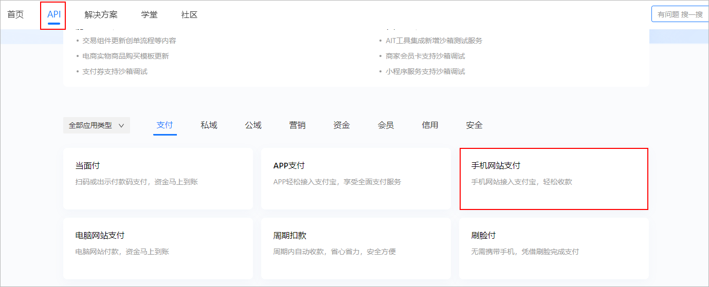
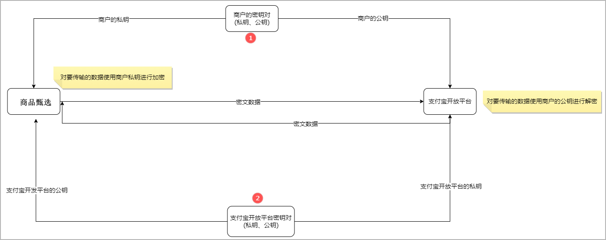
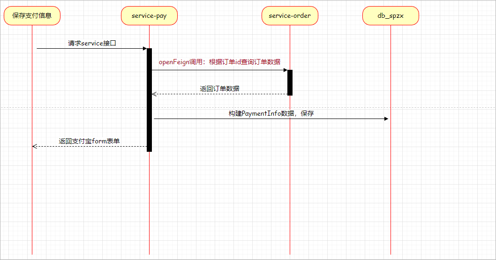

# 1 支付

## 1.1 需求说明

订单支付如图所示：

 

在支付页面点击**确认支付**按钮此时就需要对接第三方支付系统，给用户展示出第三方支付系统的收银台。


**查看接口文档：**

支付接口地址及返回结果：

```json
get /api/order/alipay/submitAlipay/{orderNo}
返回结果：
支付宝支付H5表单
```


## 1.2 支付宝支付

官网地址：https://open.alipay.com/

[支付宝（中国）网络技术有限公司](https://baike.baidu.com/item/支付宝（中国）网络技术有限公司/23241708) [1] 是国内的第三方支付平台，致力于提供“简单、安全、快速”的支付解决方案 [2] 。支付宝公司从2004年建立开始，始终以“信任”作为产品和服务的核心。旗下有“支付宝”与“支付宝钱包”两个独立品牌。自2014年第二季度开始成为当前全球最大的[移动支付](https://baike.baidu.com/item/移动支付/565488)厂商。

### 1.2.1 产品介绍

#### 产品特色

选择手机网站支付：https://open.alipay.com/api/detail?code=I1080300001000041949

 

手机网站支付是指商家在移动端网页展示商品或服务，用户在商家页面确认使用支付宝支付后，浏览器自动跳转支付宝 App 或支付宝网页完成付款的支付产品。该产品在签约完成后，需要技术集成方可使用。

#### 使用示例


#### 申请条件

支持的账号类型：[支付宝企业账号](https://opendocs.alipay.com/common/02kkum)、[支付宝个人账号](https://opendocs.alipay.com/common/02kg61)。

签约申请提交材料要求：

- 提供网站地址，网站能正常访问且页面显示完整，网站需要明确经营内容且有完整的商品信息。
- 网站必须通过 ICP 备案，且备案主体需与支付宝账号主体一致。若网站备案主体与当前账号主体不同时需上传授权函。
- 个人账号申请，需提供营业执照，且支付宝账号名称需与营业执照主体一致。

**注意**：需按照要求提交材料，若部分材料不合格，收款额度将受到限制（单笔收款 ≤ 2000 元，单日收款 ≤ 20000 元）。若签约时未能提供相关材料（如营业执照），请在合约生效后的 30 天内补全，否则会影响正常收款。

#### 费率

| **收费模式** | **费率**  |
| ------------ | --------- |
| 单笔收费     | 0.6%-1.0% |

特殊行业费率为 1.0%，非特殊行业费率为 0.6%。特殊行业包含：休闲游戏、网络游戏点卡、游戏渠道代理、游戏系统商、网游周边服务、交易平台、网游运营商（含网页游戏）等。


### 1.2.2 接入准备

官方文档：https://opendocs.alipay.com/open/203/107084?pathHash=a33de091

整体流程：

 


为了提供数据传输的安全性，在进行传输的时候需要对数据进行加密：

常见的加密方式： 

1、不可逆加密：只能会数据进行加密不能解密

2、可逆加密：可以对数据加密也可以解密

可逆加密可以再细分为：

1、对称加密： 加密和解密使用同一个秘钥

 

2、非对称加密：加密和解密使用的是不同的秘钥

 

支付宝为了提供数据传输的安全性使用了两个秘钥对：

 


### 1.2.3 手机网站支付快速接入

官方文档：https://opendocs.alipay.com/open/203/105285?pathHash=ada1de5b

系统交互流程图：

 

作为我们的项目来讲只需要将支付宝的收银台展示给用户即可，后续支付的动作和我们的系统就没有关系了。支付成功以后，支付宝开放平台会请求我们系统的接口通知支付结果，我们的系统也可以调用支付宝交易查询接口获取支付结果。


展示收银台流程图如下所示：

 


## 1.3 环境搭建(service-pay)

步骤：

* 1、在spzx-service模块下创建一个service-pay微服务,并加入如下依赖：

* 2、准备application.yml、application-dev.yml、logback-spring.xml、mybatis-config.xml文件。文件内容如下所示：

```yml
# application.yml
spring:
  profiles:
    active: dev

# application-dev.yml
server:
  port: 8515

spring:
  application:
    name: service-pay
  cloud:
    nacos:
      discovery:
        server-addr: localhost:8848
  datasource:
    type: com.zaxxer.hikari.HikariDataSource
    driver-class-name: com.mysql.cj.jdbc.Driver
    url: jdbc:mysql://localhost:3306/db_spzx?serverTimezone=UTC&characterEncoding=utf8&useUnicode=true&useSSL=true
    username: root
    password: root
  data:
    redis:
      host: localhost
      port: 6379

mybatis:
  config-location: classpath:mybatis-config.xml
  mapper-locations: classpath:mapper/*/*.xml
```

logback-spring.xml修改输出路径：

```xml
<property name="log.path" value="D://work//service-pay//logs" />
```

mybatis-config.xml：从之前的模块中进行复制

3、创建启动类

```java
// com.atguigu.spzx.pay;
@SpringBootApplication
@EnableUserWebMvcConfiguration
public class PayApplication {

    public static void main(String[] args) {
        SpringApplication.run(PayApplication.class , args) ;
    }

}
```


## 1.4 后端接口-保存支付信息

#### 实现流程说明

在支付之前需要保存支付信息到payment_info表中：

 


#### 查询订单接口开发

在service-order微服务中需要提供一个根据orderNo查询订单信息的接口，步骤如下：

1、OrderInfoMapper添加接口方法

```java
OrderInfo getByOrderNo(String orderNo) ;
```

2、OrderInfoMapper.xml映射文件添加如下sql语句

```xml
<select id="getByOrderNo" resultMap="orderInfoMap">
    select <include refid="columns" />
    from order_info
    where
    order_no = #{orderNo}
</select>
```

3、OrderInfoService业务层代码实现

```java
// 业务接口
OrderInfo getByOrderNo(String orderNo) ;

// 业务接口实现类
@Override
public OrderInfo getByOrderNo(String orderNo) {
    OrderInfo orderInfo = orderInfoMapper.getByOrderNo(orderNo);
    List<OrderItem> orderItem = orderItemMapper.findByOrderId(orderInfo.getId());
    orderInfo.setOrderItemList(orderItem);
    return orderInfo;
}
```

4、OrderInfoController表现层代码实现

```java
@Operation(summary = "获取订单信息")
@GetMapping("auth/getOrderInfoByOrderNo/{orderNo}")
public Result<OrderInfo> getOrderInfoByOrderNo(@Parameter(name = "orderId", description = "订单id", required = true) @PathVariable String orderNo) {
    OrderInfo orderInfo = orderInfoService.getByOrderNo(orderNo) ;
    return Result.build(orderInfo, ResultCodeEnum.SUCCESS);
}
```


#### openFeign接口定义

步骤：

1、在spzx-service-client模块下创建一个service-order-client的子模块

2、在service-order-client模块下定义远程openFeign接口

```java
// com.atguigu.spzx.feign.order;
@FeignClient(value = "service-order")
public interface OrderFeignClient {

    @GetMapping("/api/order/orderInfo/auth/getOrderInfoByOrderNo/{orderNo}")
    public Result<OrderInfo> getOrderInfoByOrderNo(@PathVariable String orderNo) ;

}
```


#### 代码实现

##### 添加依赖

在service-pay微服务的pom.xml中添加service-order-client的依赖：

```xml
<dependency>
    <groupId>com.atguigu.spzx</groupId>
    <artifactId>service-order-client</artifactId>
    <version>1.0-SNAPSHOT</version>
</dependency>
```

##### 修改启动类

在PayApplication启动类上添加如下代码：

```java
@EnableFeignClients(basePackages = {
        "com.atguigu.spzx.feign.order"
})
```

##### PaymentInfo

针对当前要操作的数据定义一个与之对应的实体类：

```java
// com.atguigu.spzx.model.entity.pay;
@Data
@Schema(description = "支付信息实体类")
public class PaymentInfo extends BaseEntity {

   private static final long serialVersionUID = 1L;

   @Schema(description = "用户id")
   private Long userId;

   @Schema(description = "订单号")
   private String orderNo;

   @Schema(description = "付款方式：1-微信 2-支付宝")
   private Integer payType;

   @Schema(description = "交易编号（微信或支付）")
   private String outTradeNo;

   @Schema(description = "支付金额")
   private BigDecimal amount;

   @Schema(description = "交易内容")
   private String content;

   @Schema(description = "支付状态：0-未支付 1-已支付")
   private Integer paymentStatus;

   @Schema(description = "回调时间")
   private Date callbackTime;

   @Schema(description = "回调信息")
   private String callbackContent;

}
```

##### PaymentInfoService

```java
//业务接口
public interface PaymentInfoService {
    PaymentInfo savePaymentInfo(String orderNo);
}

//业务接口实现
// com.atguigu.spzx.pay.service.impl;
@Service
public class PaymentInfoServiceImpl implements PaymentInfoService {

    @Autowired
    private PaymentInfoMapper paymentInfoMapper ;

    @Autowired
    private OrderFeignClient orderFeignClient ;

    @Override
    public PaymentInfo savePaymentInfo(String orderNo) {

        // 查询支付信息数据，如果已经已经存在了就不用进行保存(一个订单支付失败以后可以继续支付)
        PaymentInfo paymentInfo = paymentInfoMapper.getByOrderNo(orderNo);
        if(null == paymentInfo) {
            OrderInfo orderInfo = orderFeignClient.getOrderInfoByOrderNo(orderNo).getData();
            paymentInfo = new PaymentInfo();
            paymentInfo.setUserId(orderInfo.getUserId());
            paymentInfo.setPayType(orderInfo.getPayType());
            String content = "";
            for(OrderItem item : orderInfo.getOrderItemList()) {
                content += item.getSkuName() + " ";
            }
            paymentInfo.setContent(content);
            paymentInfo.setAmount(orderInfo.getTotalAmount());
            paymentInfo.setOrderNo(orderNo);
            paymentInfo.setPaymentStatus(0);
            paymentInfoMapper.save(paymentInfo);
        }
        return paymentInfo;
    }
}
```

##### PaymentInfoMapper

持久层代码实现：

```java
@Mapper
public interface PaymentInfoMapper {
    void save(PaymentInfo paymentInfo);
    PaymentInfo getByOrderNo(String orderNo);
}
```

##### PaymentInfoMapper.xml

在映射文件中定义对应的sql语句：

```xml
<?xml version="1.0" encoding="UTF-8" ?>
<!DOCTYPE mapper PUBLIC "-//mybatis.org//DTD Mapper 3.0//EN" "http://mybatis.org/dtd/mybatis-3-mapper.dtd">

<mapper namespace="com.atguigu.spzx.pay.mapper.PaymentInfoMapper">

   <resultMap id="paymentInfoMap" type="com.atguigu.spzx.model.entity.pay.PaymentInfo" autoMapping="true">
   </resultMap>
   
   <!-- 用于select查询公用抽取的列 -->
   <sql id="columns">
    id,user_id,order_no,pay_type,out_trade_no,amount,content,payment_status,callback_time,callback_content,create_time,update_time,is_deleted
   </sql>

   <insert id="save" useGeneratedKeys="true" keyProperty="id">
      insert into payment_info (
         id,
         user_id,
         order_no,
         pay_type,
         out_trade_no,
         amount,
         content,
         payment_status,
         callback_time,
         callback_content
      ) values (
         #{id},
         #{userId},
         #{orderNo},
         #{payType},
         #{outTradeNo},
         #{amount},
         #{content},
         #{paymentStatus},
         #{callbackTime},
         #{callbackContent}
      )
   </insert>

   <select id="getByOrderNo" resultMap="paymentInfoMap">
      select <include refid="columns" />
      from payment_info
      where
      order_no = #{orderNo}
   </select>
   
</mapper>
```


## 1.5 支付接口

### pom.xml

在service-pay微服务中添加alipay的依赖：

```xml
<dependency>
    <groupId>com.alipay.sdk</groupId>
    <artifactId>alipay-sdk-java</artifactId>
</dependency>
```


### application-alipay.yml

将支付宝所需要的参数定义配置文件中，以提高代码的维护性：

```properties
spzx:
  alipay:
    alipay_url: https://openapi.alipaydev.com/gateway.do
    app_id: 2021000122609658
    app_private_key: MIIEvAIBADANBgkqhkiG9w0BAQEFAASCBKYwggSiAgEAAoIBAQCXHXwKl51d5htttzJDQg1Oq+w/RAdjdGlTgGlodWxM5Vszd9IgnEffB2HlsGcpgHDteppONr8rWsEy/LmwaMR9C83YfgFPRbSIYATrQw1VynuwEFwvlW5FBT00QUqmL1AXaFGWLAao8xjRjQiArhnQA+o88DXEVnUwHTWFd8aOymesOUjJGWOId6x1MnK8om66Zxc/QFR/vZoQaE8YrATNGMMd1O1CGsnwgJ1bBOcG1Cv1dF903gllGwkLhSE3LK1/SbUg0fUi8mHU0EUyasbknlFqBdvFvJZZJ0NC+Z2sZqXV57DLa8M7bp6+YsDuc0o0EAVnLx7beYlDjwGDMgqxAgMBAAECggEAJo9UfpNviW1VJGrxvW3WXXPLRd2DESK8WZ1TyF7mMrz3x6tUiBO41zVYCrc3q8RljIOTak/X+iUfVXZdn6EsOkhPz2Vfyi2cQoxV1P54IaMYarXSACZeS+hpVLMwbDV4d3CcGPjE/kmB1L7rI4LJfWXyWHhnD+GL56ocZSFKHlcsY2bx99T+HHKTretBRnLQ8q8/iZLkTbxReaMd3o9dGTqS75d3O1nT4u0A8Pupo2dPrlE7NvtOLJMEKixToJPAfJ0b2/H1nxV19/ZW3xvRPJjSIdx32ULuUIyzkAMlH5jwO3D9NMR8fbLcsewgDAif0sPB3USpUT/4AfmJAdcVrQKBgQDf1DnUXQ/JPH/SS78W1EdUzvhGjead1NCG70gZH9YKWS3+l4wkl7l1bqrXGe17jVnPD0vHQZT7V9MjQpa0n9mGU6jKt7ym27BQwF6CLqLE82ITKKqRhUAY7D/TpXPD+DI4STmRqEWDzCgAeX2B9Y7MtOndlExPh8ZxPKtPxDPsNwKBgQCs1cH8h/nGXMv2I0hLPdIKVAQRPDCVBpzuycxn2ezHDcz5rBrYsjOpdNr3SWzcavduGI4A673uWa5znO2KE4e8Y8Uoi75wI7nx4/VapsnS8IuqpIOpkLR2ovEjxGz1BI6QyIg1Xl3QFF65BBVEucgYeLXvt/dMdUA7Z7id/h9cVwKBgDZkZmE69Dkc4JsEGT28/FCZsy/CEAbOzpXb1BN27xa4sTqrLT0/OaxV5mI7RMC/itGMkAet4jxqDT8GUYU3Sy8faWdJ2yhZPrGA7faIyrk9w9mQClMupHLqBmCyVj2LNPkEol7JG4t5s0baPyuztq38UNCt1xWEky61ZZQOw+dlAoGAQdEhD0bEwlpCPZhQBn8jRlWaOun94jJjfreQRJgDiAXkYcu9aXnrHIPogrUOZJ3DXcSyBv2/FU5HlbVT6/nl/cLMqNUWj2O7grb5jyzmvJJnzXLaxK7bWjZQt/ssNt4mYFJNNG2cMgofzDsW0lYhMdh+CCy5Wv9nl3e3IUtNq/8CgYASPcPdaCBLzCSGlTV9HMhQwRhOpWLOzQNKprebQf0fubNFGd6+yfM6DdejHXf6KH4IgV9l8OPe5ro85tmrBkvMlbh7KHbpYJ/V9cdMKd+kbxoJTkRKCnoZhY5QSuEMoC8OB1qhzJeuoqUvmpi0q569IBXrxZguD29ZqwGxoa1KNg==
    alipay_public_key: MIIBIjANBgkqhkiG9w0BAQEFAAOCAQ8AMIIBCgKCAQEAk41ooyX7utKM9B7jNcc4EzmyVU0Qfs18KFVFwyhl7YQMw/PB2YVQreVSvvb1rS/2YVxcjLK/9ehD//79b8aoxhFlEGqA7fGu0C2UR6pl+PhmRLcHeyN+DOG87Fhqb1t4JXmXQc1LXUfelJoh+r5XnMPWDAlY5JJtH3GZIU+AoBt9PuEtfhh03LL6WtnJMwOnqH94T8qHymLDftEGOWme1iAlenB692cUId20BmLJal621EAN+xpmkeJZEpx1wQ2fGhyTo7pm4v8LVLuqzOXkraffITvfbPl5IU0kjjs/QECwItAI0IBbNsDutezw/a0JobijjoF28uo4gtwmncBoQwIDAQAB
    return_payment_url: http://192.168.136.142/#/pages/money/paySuccess
    notify_payment_url: http://127.0.0.1:8500/api/order/alipay/callback/notify
```

在application-dev.yml文件中导入该配置：

```yml
spring:
  config:
    import: application-alipay.yml
```


### AlipayProperties

定义一个实体类读取配置文件内

```java
// com.atguigu.spzx.pay.properties;
@Data
@ConfigurationProperties(prefix = "spzx.alipay")
public class AlipayProperties {

    private String alipayUrl;
    private String appPrivateKey;
    public  String alipayPublicKey;
    private String appId;
    public  String returnPaymentUrl;
    public  String notifyPaymentUrl;

    public final static String format="json";
    public final static String charset="utf-8";
    public final static String sign_type="RSA2";

}
```


### 修改启动类(PayApplication)

在启动类上添加**@EnableConfigurationProperties**注解，开启通过实体类读取配置文件内容封装数据功能：

```java
@EnableConfigurationProperties(value = { AlipayProperties.class })
```


### AlipayConfiguration

定义一个AlipayConfiguration的配置类，配置发送请求的核心对象：AlipayClient

```java
//  com.atguigu.spzx.pay.configuration;
@Configuration
public class AlipayConfiguration {

    @Autowired
    private AlipayProperties alipayProperties ;

    @Bean
    public AlipayClient alipayClient(){
        AlipayClient alipayClient = new DefaultAlipayClient(alipayProperties.getAlipayUrl() ,
                alipayProperties.getAppId() ,
                alipayProperties.getAppPrivateKey() ,
                AlipayProperties.format ,
                AlipayProperties.charset ,
                alipayProperties.getAlipayPublicKey() ,
                AlipayProperties.sign_type );
        return alipayClient;
    }

}
```


### AlipayController

```java
// com.atguigu.spzx.pay.controller
@Controller
@RequestMapping("/api/order/alipay")
public class AlipayController {

    @Autowired
    private AlipayService alipayService;

    @Operation(summary="支付宝下单")
    @GetMapping("submitAlipay/{orderNo}")
    @ResponseBody
    public Result<String> submitAlipay(@Parameter(name = "orderNo", description = "订单号", required = true) @PathVariable(value = "orderNo") String orderNo) {
        String form = alipayService.submitAlipay(orderNo);
        return Result.build(form, ResultCodeEnum.SUCCESS);
    }
}
```


### AlipayService

```java
//业务接口
public interface AlipayService {
    String submitAlipay(String orderNo);
}

//业务接口实现
// com.atguigu.spzx.pay.service.impl;
@Slf4j
@Service
public class AlipayServiceImpl implements AlipayService {

    @Autowired
    private AlipayClient alipayClient;

    @Autowired
    private PaymentInfoService paymentInfoService;

    @Autowired
    private AlipayProperties alipayProperties ;

    @SneakyThrows  // lombok的注解，对外声明异常
    @Override
    public String submitAlipay(String orderNo) {

        //保存支付记录
        PaymentInfo paymentInfo = paymentInfoService.savePaymentInfo(orderNo);

        //创建API对应的request
        AlipayTradeWapPayRequest alipayRequest = new AlipayTradeWapPayRequest();

        // 同步回调
        alipayRequest.setReturnUrl(alipayProperties.getReturnPaymentUrl());

        // 异步回调
        alipayRequest.setNotifyUrl(alipayProperties.getNotifyPaymentUrl());

        // 准备请求参数 ，声明一个map 集合
        HashMap<String, Object> map = new HashMap<>();
        map.put("out_trade_no",paymentInfo.getOrderNo());
        map.put("product_code","QUICK_WAP_WAY");
        //map.put("total_amount",paymentInfo.getAmount());
        map.put("total_amount",new BigDecimal("0.01"));
        map.put("subject",paymentInfo.getContent());
        alipayRequest.setBizContent(JSON.toJSONString(map));

        // 发送请求
        AlipayTradeWapPayResponse response = alipayClient.pageExecute(alipayRequest);
        if(response.isSuccess()){
            log.info("调用成功");
            return response.getBody();
        } else {
            log.info("调用失败");
            throw new GuiguException(ResultCodeEnum.DATA_ERROR);
        }
    }

}
```


### 服务网关

在spzx-server-gateway网关中配置service-pay微服务的路由规则：

```yml
spring:
  cloud:
    gateway:
      routes:
        - id: service-pay
          uri: lb://service-pay
          predicates:
            - Path=/api/order/alipay/**
```


## 1.6 异步回调

### 1.6.1 支付宝异步回调概述

#### 异步通知说明

官网地址：https://opendocs.alipay.com/open/203/105286?pathHash=022a439c&ref=api

 

#### 通知流程说明

当用户支付成功以后，支付宝系统会调用我们系统的接口通知支付结果，整体流程如下所示：

 


### 1.6.2 配置内网穿透

#### 内网穿透介绍

在service-pay微服务中开发一个接口供支付宝进行调用：

```java
// com.atguigu.spzx.pay.controller.AlipayController
@RequestMapping("callback/notify")
@ResponseBody
public String alipayNotify(@RequestParam Map<String, String> paramMap, HttpServletRequest request) {
    log.info("AlipayController...alipayNotify方法执行了...");
    return "success" ;
}
```

当支付成功以后支付宝无法调用本地接口，因为本地接口是位于一个私有IP地址范围内，并且被路由器或防火墙等设备保护起来。这个私有的网络设备无法直接从公共网络访问，该问题的解决可以使用内网穿透技术。


内网穿透：内网穿透（Intranet Port Forwarding）是一种将本地网络中的服务暴露给公共网络访问的技术。

内网穿透通过在公共网络上建立一个中转服务器，使得公共网络上的设备可以通过该中转服务器访问内网中的设备和服务。具体而言，内网穿透技术允许您在公共网络上使用一个公网IP地址和端口号来映射到内网中的某个设备或服务的私有IP地址和端口号。

 

常见的内网穿透工具包括**natapp**、**Ngrok**、frp、花生壳等。


#### 配置内网穿透(ngrok)

##### （1）注册用户

网址：https://ngrok.cc/login/register


##### （2）实名认证

* 注册成功之后，登录系统，进行实名认证，认证费2元，认证通过后才能开通隧道


##### （3）开通隧道

* 选择隧道管理 -> 开通隧道

**最后一个是免费服务器，建议选择付费服务器，10元/月，因为免费服务器使用人数很多，经常掉线**


* 点击立即购买 -> 输入相关信息


* 开通成功后，查看开通的隧道

**这里开通了两个隧道，一个用于后端接口调用，一个用于公众号前端调用**


##### （4）启动隧道

* 下载客户端工具


* 选择windows版本


* 解压，找到bat文件，双击启动


* 输入隧道id，多个使用逗号隔开，最后回车就可以启动


### 1.6.3 验证签名

支付宝回传过来的数据需要进行合法性的校验，校验通过以后才可以走后续的流程，具体代码如下所示：

```java
// com.atguigu.spzx.pay.controller.AlipayController
@Operation(summary="支付宝异步回调")
@RequestMapping("callback/notify")
@ResponseBody
public String alipayNotify(@RequestParam Map<String, String> paramMap, HttpServletRequest request) {
    log.info("AlipayController...alipayNotify方法执行了...");
    boolean signVerified = false; //调用SDK验证签名
    try {
        signVerified = AlipaySignature.rsaCheckV1(paramMap, alipayProperties.getAlipayPublicKey(), AlipayProperties.charset, AlipayProperties.sign_type);
    } catch (AlipayApiException e) {
        e.printStackTrace();
    }

    // 交易状态
    String trade_status = paramMap.get("trade_status");

    // true
    if (signVerified) {

        // TODO 验签成功后，按照支付结果异步通知中的描述，对支付结果中的业务内容进行二次校验，校验成功后在response中返回success并继续商户自身业务处理，校验失败返回failure
        if ("TRADE_SUCCESS".equals(trade_status) || "TRADE_FINISHED".equals(trade_status)) {
            // 正常的支付成功，我们应该更新交易记录状态
            paymentInfoService.updatePaymentStatus(paramMap, 2);
            return "success";
        }

    } else {
        // TODO 验签失败则记录异常日志，并在response中返回failure.
        return "failure";
    }

    return "failure";
}
```


### 1.6.4 更新支付信息

#### PaymentInfoService

```java
//业务接口
void updatePaymentStatus(Map<String, String> map, Integer payType);


@Transactional
@Override
public void updatePaymentStatus(Map<String, String> map, Integer payType) {
    
    // 查询PaymentInfo
    PaymentInfo paymentInfo = paymentInfoMapper.getByOrderNo(map.get("out_trade_no"));
    if (paymentInfo.getPaymentStatus() == 1) {
        return;
    }

    //更新支付信息
    paymentInfo.setPaymentStatus(1);
    paymentInfo.setOutTradeNo(map.get("trade_no"));
    paymentInfo.setCallbackTime(new Date());
    paymentInfo.setCallbackContent(JSON.toJSONString(map));
    paymentInfoMapper.updateById(paymentInfo);

}
```

#### PaymentInfoMapper

```java
void updateById(PaymentInfo paymentInfo);
```

#### PaymentInfoMapper.xml

```xml
<update id="updateById" >
   update payment_info set
   <if test="userId != null and userId != ''">
      user_id = #{userId},
   </if>
   <if test="orderNo != null and orderNo != ''">
      order_no = #{orderNo},
   </if>
   <if test="payType != null">
      pay_type = #{payType},
   </if>
   <if test="outTradeNo != null and outTradeNo != ''">
      out_trade_no = #{outTradeNo},
   </if>
   <if test="amount != null and amount != ''">
      amount = #{amount},
   </if>
   <if test="content != null and content != ''">
      content = #{content},
   </if>
   <if test="paymentStatus != null">
      payment_status = #{paymentStatus},
   </if>
   <if test="callbackTime != null">
      callback_time = #{callbackTime},
   </if>
   <if test="callbackContent != null and callbackContent != ''">
      callback_content = #{callbackContent},
   </if>
   update_time =  now()
   where
   id = #{id}
</update>
```


### 1.6.5 更新订单支付状态

具体步骤：

1、在service-order微服务中开发一个更新订单支付状态的接口供service-pay微服务进行调用

```java
// com.atguigu.spzx.order.controller.OrderInfoController
@Operation(summary = "获取订单分页列表")
@GetMapping("auth/updateOrderStatusPayed/{orderNo}/{orderStatus}")
public Result updateOrderStatus(@PathVariable(value = "orderNo") String orderNo , @PathVariable(value = "orderStatus") Integer orderStatus) {
    orderInfoService.updateOrderStatus(orderNo , orderStatus);
    return Result.build(null , ResultCodeEnum.SUCCESS) ;
}

// com.atguigu.spzx.order.service.impl.OrderInfoServiceImpl
@Transactional
@Override
public void updateOrderStatus(String orderNo, Integer orderStatus) {

    // 更新订单状态
    OrderInfo orderInfo = orderInfoMapper.getByOrderNo(orderNo);
    orderInfo.setOrderStatus(1);
    orderInfo.setPayType(orderStatus);
    orderInfo.setPaymentTime(new Date());
    orderInfoMapper.updateById(orderInfo);

    // 记录日志
    OrderLog orderLog = new OrderLog();
    orderLog.setOrderId(orderInfo.getId());
    orderLog.setProcessStatus(1);
    orderLog.setNote("支付宝支付成功");
    orderLogMapper.save(orderLog);
}

// com.atguigu.spzx.order.mapper.OrderInfoMapper
void updateById(OrderInfo orderInfo);
```

OrderInfoMapper.xml映射文件中添加sql语句：

```xml
<update id="updateById" >
    update order_info set
    <if test="userId != null and userId != ''">
        user_id = #{userId},
    </if>
    <if test="nickName != null and nickName != ''">
        nick_name = #{nickName},
    </if>
    <if test="orderNo != null and orderNo != ''">
        order_no = #{orderNo},
    </if>
    <if test="couponId != null and couponId != ''">
        coupon_id = #{couponId},
    </if>
    <if test="totalAmount != null and totalAmount != ''">
        total_amount = #{totalAmount},
    </if>
    <if test="couponAmount != null and couponAmount != ''">
        coupon_amount = #{couponAmount},
    </if>
    <if test="originalTotalAmount != null and originalTotalAmount != ''">
        original_total_amount = #{originalTotalAmount},
    </if>
    <if test="feightFee != null and feightFee != ''">
        feight_fee = #{feightFee},
    </if>
    <if test="payType != null">
        pay_type = #{payType},
    </if>
    <if test="orderStatus != null">
        order_status = #{orderStatus},
    </if>
    <if test="receiverName != null and receiverName != ''">
        receiver_name = #{receiverName},
    </if>
    <if test="receiverPhone != null and receiverPhone != ''">
        receiver_phone = #{receiverPhone},
    </if>
    <if test="receiverTagName != null and receiverTagName != ''">
        receiver_tag_name = #{receiverTagName},
    </if>
    <if test="receiverProvince != null and receiverProvince != ''">
        receiver_province = #{receiverProvince},
    </if>
    <if test="receiverCity != null and receiverCity != ''">
        receiver_city = #{receiverCity},
    </if>
    <if test="receiverDistrict != null and receiverDistrict != ''">
        receiver_district = #{receiverDistrict},
    </if>
    <if test="receiverAddress != null and receiverAddress != ''">
        receiver_address = #{receiverAddress},
    </if>
    <if test="paymentTime != null">
        payment_time = #{paymentTime},
    </if>
    <if test="deliveryTime != null">
        delivery_time = #{deliveryTime},
    </if>
    <if test="receiveTime != null">
        receive_time = #{receiveTime},
    </if>
    <if test="remark != null and remark != ''">
        remark = #{remark},
    </if>
    <if test="cancelTime != null and cancelTime != ''">
        cancel_time = #{cancelTime},
    </if>
    <if test="cancelReason != null and cancelReason != ''">
        cancel_reason = #{cancelReason},
    </if>
    update_time =  now()
    where
    id = #{id}
</update>
```

2、openFeign远程调用接口定义

```java
// com.atguigu.spzx.feign.order.OrderFeignClient
@FeignClient(value = "service-order")
public interface OrderFeignClient {

    @GetMapping("/api/order/orderInfo/auth/updateOrderStatusPayed/{orderNo}/{orderStatus}")
    public abstract Result updateOrderStatus(@PathVariable(value = "orderNo") String orderNo , @PathVariable(value = "orderStatus") Integer orderStatus) ;
}
```

3、PaymentInfoService业务代码修改

```java
// com.atguigu.spzx.pay.service.impl.PaymentInfoServiceImpl
@Transactional
@Override
public void updatePaymentStatus(Map<String, String> map, Integer payType) {

    // 1、查询PaymentInfo
    // 2、更新支付信息
    // 3、更新订单的支付状态
    orderFeignClient.updateOrderStatus(paymentInfo.getOrderNo() , payType) ;

}
```


### 1.6.6 更新商品销量

操作模块：service-product

#### SkuSaleDto

定义远程调用传输的数据的实体类：

```java
@Data
public class SkuSaleDto {

   private Long skuId;
   private Integer num;

}
```

#### ProductController

表现层代码：

```java
@Operation(summary = "更新商品sku销量")
@PostMapping("updateSkuSaleNum")
public Boolean updateSkuSaleNum(@RequestBody List<SkuSaleDto> skuSaleDtoList) {
   return productService.updateSkuSaleNum(skuSaleDtoList);
}
```

#### ProductService

业务层代码实现：

```java
//业务接口
Boolean updateSkuSaleNum(List<SkuSaleDto> skuSaleDtoList);

//业务接口实现
@Transactional
@Override
public Boolean updateSkuSaleNum(List<SkuSaleDto> skuSaleDtoList) {
    if(!CollectionUtils.isEmpty(skuSaleDtoList)) {
        for(SkuSaleDto skuSaleDto : skuSaleDtoList) {
            productSkuMapper.updateSale(skuSaleDto.getSkuId(), skuSaleDto.getNum());
        }
    }
    return true;
}
```

#### ProductSkuMapper

```java
void updateSale(@Param("skuId") Long skuId, @Param("num") Integer num);
```

#### ProductSkuMapper.xml

```xml
<update id="updateSale" >
   update product_sku set sale_num = sale_num + #{num}, stock_num = stock_num - #{num}, update_time =  now() where id = #{skuId}
</update>
```

#### ProductFeignClient

操作模块：service-product-client

远程调用Feign接口

```java
/**
 * 更新商品sku销量
 * @param skuSaleDtoList
 * @return
 */
@PostMapping("/api/product/updateSkuSaleNum")
Boolean updateSkuSaleNum(@RequestBody List<SkuSaleDto> skuSaleDtoList);
```

#### PaymentInfoService

修改PaymentInfoService业务代码修改

```java
@Transactional
@Override
public void updatePaymentStatus(Map<String, String> map, Integer payType) {

    // 1、查询PaymentInfo
    // 2、更新支付信息
    // 3、更新订单的支付状态
    // 4、更新商品销量
    OrderInfo orderInfo = orderFeignClient.getOrderInfoByOrderNo(paymentInfo.getOrderNo());
    List<SkuSaleDto> skuSaleDtoList = orderInfo.getOrderItemList().stream().map(item -> {
        SkuSaleDto skuSaleDto = new SkuSaleDto();
        skuSaleDto.setSkuId(item.getSkuId());
        skuSaleDto.setNum(item.getSkuNum());
        return skuSaleDto;
    }).collect(Collectors.toList());
    productFeignClient.updateSkuSaleNum(skuSaleDtoList) ;

}
```

